# 🚀 AI Engineer Mastery: From First Principles to Production

Ek comprehensive, implementation-first repository jo linear algebra aur classical machine learning se lekar deep neural networks, transformer architectures, LLM systems, aur production infrastructure tak pura track cover karti hai.

---

## 🗺️ Master Curriculum Architecture

```mermaid
flowchart TD
    classDef foundation fill:#1e293b,stroke:#38bdf8,stroke-width:2px,color:#fff;
    classDef classical fill:#1e293b,stroke:#34d399,stroke-width:2px,color:#fff;
    classDef deep fill:#1e293b,stroke:#f59e0b,stroke-width:2px,color:#fff;
    classDef nlp fill:#1e293b,stroke:#a855f7,stroke-width:2px,color:#fff;
    classDef infra fill:#1e293b,stroke:#ef4444,stroke-width:2px,color:#fff;

    subgraph P1["Phase 01: Foundations & Scientific Computing"]
        A1["NumPy: Tensor Operations & Broadcasting"]
        A2["Pandas: Wrangling, Merging & Aggregations"]
        A3["Matplotlib & Seaborn: Distribution & Relationship EDA"]
    end
    class P1,A1,A2,A3 foundation;

    subgraph P2["Phase 02: Classical Machine Learning & Mathematics"]
        B1["Supervised Regression (OLS, Regularization, SVR)"]
        B2["Supervised Classification (Logistic, SVM, Decision Trees)"]
        B3["Ensemble Methods (Bagging, AdaBoost, XGBoost, LightGBM)"]
        B4["Unsupervised Learning (K-Means, DBSCAN, PCA, t-SNE)"]
        B5["Evaluation Protocols & Scikit-Learn Pipelines"]
    end
    class P2,B1,B2,B3,B4,B5 classical;

    subgraph P3["Phase 03: Deep Learning & Neural Computation"]
        C1["Matrix Calculus, Backprop & PyTorch Autograd"]
        C2["Optimization Dynamics (Momentum, RMSprop, AdamW)"]
        C3["Computer Vision: Convolutions, Pooling & ResNet Skip Connections"]
        C4["Modular Training Loops & Validation Pipelines"]
    end
    class P3,C1,C2,C3,C4 deep;

    subgraph P4["Phase 04: Sequence Modeling & Transformer Architectures"]
        D1["Text Embeddings: Word2Vec (Skip-Gram/CBOW) & Subword Tokenizers"]
        D2["Recurrent Networks: Vanilla RNN, LSTM Gating & Bi-GRUs"]
        D3["Attention Mechanisms: Additive vs. Scaled Dot-Product"]
        D4["Transformer from Scratch: Multi-Head Attention & Residual Blocks"]
        D5["Modern LLM Systems: PEFT, LoRA/QLoRA & RAG Pipelines"]
    end
    class P4,D1,D2,D3,D4,D5 nlp;

    subgraph P5["Phase 05: AI Infrastructure & MLOps"]
        E1["Model Serving: Asynchronous APIs with FastAPI"]
        E2["Inference Optimization: ONNX Runtime & Quantization"]
        E3["Containerization & Experiment Tracking: Docker + MLflow"]
    end
    class P5,E1,E2,E3 infra;

P1 --> P2 --> P3 --> P4 --> P5
```


# Repository Anatomy
```text
Machine Learning-II/

│
├── 01_data_science_foundations/
│   ├── numpy/
│   │   └── 01_array_math_and_broadcasting.ipynb       # Vectorized math, axis manipulation, broadcasting rules
│   ├── pandas/
│   │   └── 02_data_wrangling_and_aggregation.ipynb     # Indexing, grouping, reshaping, memory optimization
│   └── data_visualization/
│       └── 03_eda_matplotlib_seaborn.ipynb            # Univariate/bivariate analysis, statistical distributions
│
├── 02_classical_machine_learning/
│   ├── regression/
│   │   ├── 01_linear_and_polynomial_regression.ipynb   # OLS normal equation, gradient descent, polynomial bases
│   │   └── 02_ridge_lasso_regularization.ipynb        # L1 (sparsity) vs L2 (weight decay) penalties
│   ├── classification/
│   │   ├── 03_logistic_regression_from_scratch.ipynb  # Sigmoid, binary cross-entropy, decision boundaries
│   │   ├── 04_knn_and_svm.ipynb                       # Distance metrics, maximal margin hyperplanes, kernel trick
│   │   └── 05_decision_trees_and_naive_bayes.ipynb    # Information gain, Gini impurity, Bayes' theorem
│   ├── ensemble_methods/
│   │   ├── 06_random_forest_and_adaboost.ipynb        # Bootstrap aggregation, feature subsampling, adaptive weighting
│   │   └── 07_xgboost_and_lightgbm.ipynb              # Second-order Taylor gradient boosting, histogram binning
│   ├── unsupervised_learning/
│   │   ├── 08_kmeans_and_dbscan.ipynb                 # Centroid optimization, density-based noise handling
│   │   └── 09_pca_dimensionality_reduction.ipynb      # Covariance matrix, eigenvalue decomposition, variance ratios
│   └── evaluation_and_pipelines/
│       └── 10_cross_validation_and_pipelines.ipynb   # Leak-free ColumnTransformers, ROC-AUC, PR Curves
│
├── 03_deep_learning_pytorch/
│   ├── foundations/
│   │   ├── 01_tensors_autograd_and_mlp.ipynb          # Computational graphs, backward pass, manual MLP
│   │   └── 02_custom_loss_and_optimizers.ipynb        # Custom loss functions, implementing AdamW from equations
│   ├── convolutional_networks/
│   │   └── 03_cnn_and_resnet_transfer_learning.ipynb  # Convolutions, residual connections, pretrained vision backbones
│   └── custom_training_loops/
│       └── 04_modular_pytorch_pipeline.py             # Decoupled Dataset, Dataloader, Trainer, and Evaluator classes
│
├── 04_nlp_and_sequence_models/
│   ├── text_preprocessing_embeddings/
│   │   └── 01_tokenization_and_word2vec.ipynb         # BPE tokenization, skip-gram with negative sampling
│   ├── recurrent_networks/
│   │   ├── 02_rnn_and_lstm_from_scratch.ipynb         # Vanishing gradients, input/forget/output cell gates
│   │   └── 03_gru_text_classification.ipynb           # Reset and update gates, sequence-to-label modeling
│   └── attention_mechanisms/
│       └── 04_seq2seq_with_attention.ipynb            # Bahdanau additive vs Luong multiplicative attention
│
├── 05_transformers_and_llms/
│   ├── transformer_from_scratch/
│   │   ├── 01_scaled_dot_product_attention.ipynb      # Q, K, V matrix projections, attention maps
│   │   └── 02_multihead_attention_and_transformer_blocks.ipynb # Pre-LN, sinusoidal/RoPE embeddings, FFN blocks
│   ├── huggingface_implementations/
│   │   └── 03_bert_fine_tuning.ipynb                  # Hugging Face Trainer, tokenizers, sequence classification
│   ├── peft_and_finetuning/
│   │   └── 04_qlora_instruction_tuning.ipynb          # Parameter-Efficient Fine-Tuning, Low-Rank Adaptation (LoRA)
│   └── rag_systems/
│       └── 05_vector_search_rag_pipeline.py           # Hybrid retrieval, FAISS/ChromaDB indexing, prompt injection
│
├── 06_ai_infrastructure_mlops/
│   ├── serving_fastapi/
│   │   └── app.py                                     # High-performance async model inference API
│   ├── model_quantization_onnx/
│   │   └── export_to_onnx.py                          # PyTorch to ONNX graph translation, INT8 quantization
│   ├── docker_packaging/
│   │   └── Dockerfile                                 # Multi-stage production container build
│   └── mlflow_tracking/
│       └── track_experiments.py                       # Experiment logging, artifact storage, metric curves
│
├── data/
│   ├── raw/                                           # Unmodified raw datasets
│   └── processed/                                     # Cleaned, transformed matrices and tensors
│
├── .gitignore                                         # Large weights, venv aur cache ko ignore karne ke liye
├── requirements.txt                                   # Reproducible dependencies specification
└── README.md

# 🛠️ Environment Initialization & Setup
1. Initialize Virtual Environment

# Repository clone karo
git clone [https://github.com/](https://github.com/)<YOUR_GITHUB_USERNAME>/<YOUR_REPO_NAME>.git
cd Machine\ Learning-II

# Virtual environment create aur activate karo
python3 -m venv .venv
source .venv/bin/activate

# Pip aur setup tools upgrade karo
pip install --upgrade pip setuptools wheel

2. Install Dependencies

# PyTorch CPU-optimized build install karo
pip install torch torchvision torchaudio --index-url [https://download.pytorch.org/whl/cpu](https://download.pytorch.org/whl/cpu)

# Baaki saari libraries requirements file se install karo
pip install -r requirements.txt

# Jupyter Notebook me kernel register karo
python -m ipykernel install --user --name=ml-ii-env --display-name="Python (ML-II Env)"

