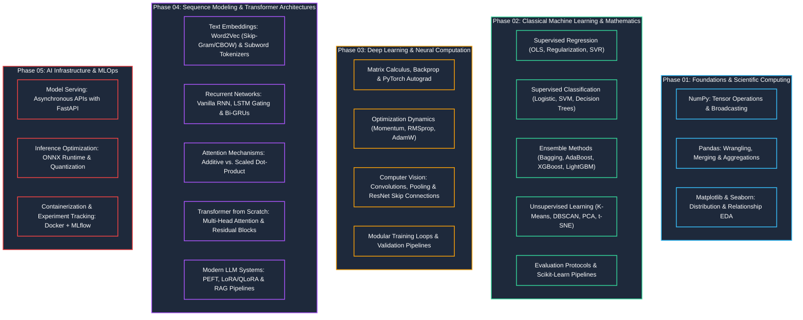

# 🚀 AI Engineer Mastery: From First Principles to Production

Ek comprehensive, implementation-first repository jo linear algebra aur classical machine learning se lekar deep neural networks, transformer architectures, LLM systems, aur production infrastructure tak pura track cover karti hai.

---

## 🗺️ Master Curriculum Architecture


```text

Machine Learning-II/
│
├── 01_data_science_foundations/
│   ├── numpy/
│   │   └── 01_array_math_and_broadcasting.ipynb       # Vectorized math, axis manipulation, broadcasting rules
│   ├── pandas/
│   │   └── 02_data_wrangling_and_aggregation.ipynb     # Indexing, grouping, reshaping, memory optimization
│   └── data_visualization/
│       └── 03_eda_matplotlib_seaborn.ipynb            # Univariate/bivariate analysis, statistical distributions
│
├── 02_classical_machine_learning/
│   ├── regression/
│   │   ├── 01_linear_and_polynomial_regression.ipynb   # OLS normal equation, gradient descent, polynomial bases
│   │   └── 02_ridge_lasso_regularization.ipynb        # L1 (sparsity) vs L2 (weight decay) penalties
│   ├── classification/
│   │   ├── 03_logistic_regression_from_scratch.ipynb  # Sigmoid, binary cross-entropy, decision boundaries
│   │   ├── 04_knn_and_svm.ipynb                       # Distance metrics, maximal margin hyperplanes, kernel trick
│   │   └── 05_decision_trees_and_naive_bayes.ipynb    # Information gain, Gini impurity, Bayes' theorem
│   ├── ensemble_methods/
│   │   ├── 06_random_forest_and_adaboost.ipynb        # Bootstrap aggregation, feature subsampling, adaptive weighting
│   │   └── 07_xgboost_and_lightgbm.ipynb              # Second-order Taylor gradient boosting, histogram binning
│   ├── unsupervised_learning/
│   │   ├── 08_kmeans_and_dbscan.ipynb                 # Centroid optimization, density-based noise handling
│   │   └── 09_pca_dimensionality_reduction.ipynb      # Covariance matrix, eigenvalue decomposition, variance ratios
│   └── evaluation_and_pipelines/
│       └── 10_cross_validation_and_pipelines.ipynb   # Leak-free ColumnTransformers, ROC-AUC, PR Curves
│
├── 03_deep_learning_pytorch/
│   ├── foundations/
│   │   ├── 01_tensors_autograd_and_mlp.ipynb          # Computational graphs, backward pass, manual MLP
│   │   └── 02_custom_loss_and_optimizers.ipynb        # Custom loss functions, implementing AdamW from equations
│   ├── convolutional_networks/
│   │   └── 03_cnn_and_resnet_transfer_learning.ipynb  # Convolutions, residual connections, pretrained vision backbones
│   └── custom_training_loops/
│       └── 04_modular_pytorch_pipeline.py             # Decoupled Dataset, Dataloader, Trainer, and Evaluator classes
│
├── 04_nlp_and_sequence_models/
│   ├── text_preprocessing_embeddings/
│   │   └── 01_tokenization_and_word2vec.ipynb         # BPE tokenization, skip-gram with negative sampling
│   ├── recurrent_networks/
│   │   ├── 02_rnn_and_lstm_from_scratch.ipynb         # Vanishing gradients, input/forget/output cell gates
│   │   └── 03_gru_text_classification.ipynb           # Reset and update gates, sequence-to-label modeling
│   └── attention_mechanisms/
│       └── 04_seq2seq_with_attention.ipynb            # Bahdanau additive vs Luong multiplicative attention
│
├── 05_transformers_and_llms/
│   ├── transformer_from_scratch/
│   │   ├── 01_scaled_dot_product_attention.ipynb      # Q, K, V matrix projections, attention maps
│   │   └── 02_multihead_attention_and_transformer_blocks.ipynb # Pre-LN, sinusoidal/RoPE embeddings, FFN blocks
│   ├── huggingface_implementations/
│   │   └── 03_bert_fine_tuning.ipynb                  # Hugging Face Trainer, tokenizers, sequence classification
│   ├── peft_and_finetuning/
│   │   └── 04_qlora_instruction_tuning.ipynb          # Parameter-Efficient Fine-Tuning, Low-Rank Adaptation (LoRA)
│   └── rag_systems/
│       └── 05_vector_search_rag_pipeline.py           # Hybrid retrieval, FAISS/ChromaDB indexing, prompt injection
│
├── 06_ai_infrastructure_mlops/
│   ├── serving_fastapi/
│   │   └── app.py                                     # High-performance async model inference API
│   ├── model_quantization_onnx/
│   │   └── export_to_onnx.py                          # PyTorch to ONNX graph translation, INT8 quantization
│   ├── docker_packaging/
│   │   └── Dockerfile                                 # Multi-stage production container build
│   └── mlflow_tracking/
│       └── track_experiments.py                       # Experiment logging, artifact storage, metric curves
│
├── data/
│   ├── raw/                                           # Unmodified raw datasets
│   └── processed/                                     # Cleaned, transformed matrices and tensors
│
├── .gitignore                                         # Prevents pushing large weights, venv, and checkpoints
├── requirements.txt                                   # Reproducible environment specifications
└── README.md
```
01. Data Science Foundations
NumPy: Vectorized calculations, matrix multiplication, array broadcasting, axis-based manipulations bina slow loops ke.

Pandas: Efficient data wrangling, missing data strategies, merging/joining, groupby aggregations, downcasting.

Data Visualization: Univariate analysis (histograms, KDEs), correlation heatmaps, multivariate feature distributions using Matplotlib and Seaborn.

02. Classical Machine Learning
Regression: Ordinary Least Squares (OLS) closed-form matrix math, Gradient Descent, Polynomial features, Ridge (L2) vs. Lasso (L1) regularization.

Classification: Binary cross-entropy loss, Logistic Regression from scratch, maximum-margin separation (SVM), Decision Tree splits (Entropy/Gini).

Ensemble Methods: Bagging (Random Forest with out-of-bag scoring) aur Boosting (AdaBoost, Gradient Boosting, XGBoost, LightGBM).

Unsupervised Learning: Centroid updates in K-Means, density clustering with DBSCAN, Dimensionality Reduction using PCA.

Pipelines & Evaluation: Cross-validation without data leakage, custom ColumnTransformers, Precision-Recall curves, ROC-AUC.

03. Deep Learning (PyTorch)
Foundations: PyTorch autograd engine, computational graphs, manual backpropagation, fully connected Multi-Layer Perceptrons (MLPs).

Optimization & Losses: Custom loss functions aur AdamW / RMSprop optimization equations se scratch build karna.

Computer Vision: 2D Convolutions, pooling, stride math, ResNet skip-connections transfer learning ke liye.

Modular Pipelines: Clean training scripts jo Dataset, DataLoader, Trainer, aur Evaluator me divided ho.

04. NLP & Sequence Models
Embeddings: Subword tokenization (BPE), Continuous Bag of Words (CBOW), Skip-Gram Word2Vec negative sampling ke sath.

Recurrent Architectures: Vanishing/exploding gradient problems ko solve karne ke liye LSTM gates (forget, input, cell, output) aur GRUs.

Attention Mechanisms: Additive (Bahdanau) aur multiplicative (Luong) attention sequence-to-sequence problems ke liye.

05. Transformers & Modern LLMs
Transformer from Scratch: Scaled dot-product attention, Multi-Head Attention, Sinusoidal / RoPE positional encodings, Pre-LN blocks.

Hugging Face Ecosystem: Transformer models ko fine-tune karna using transformers, datasets, aur accelerate.

PEFT & Quantization: Low-Rank Adaptation (LoRA) aur 4-bit quantization (QLoRA) open-source LLMs ko tune karne ke liye.

RAG Systems: Semantic chunking, dense embeddings, vector retrieval using FAISS/ChromaDB.

06. AI Infrastructure & MLOps
Model Serving: Production-ready async REST APIs with FastAPI aur Pydantic schemas.

Inference Optimization: Graph freezing aur PyTorch models ko ONNX format me INT8 quantization ke sath export karna.

Containerization: Multi-stage Docker packaging clean dependencies ke liye.

Experiment Tracking: Hyperparameters, loss curves, aur model weights ko track karna using MLflow.
```
